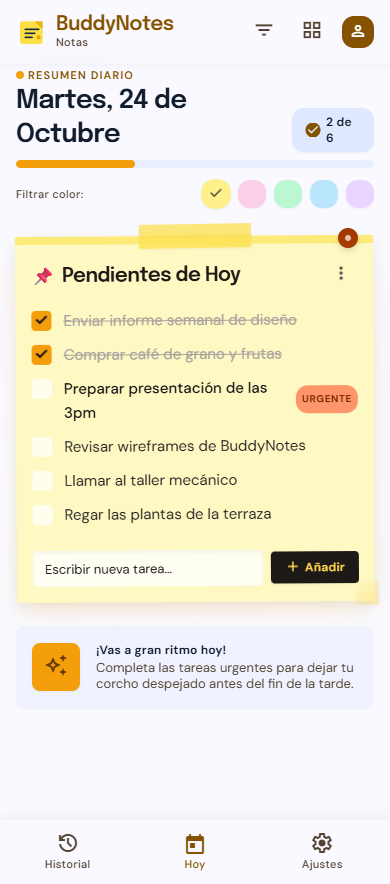
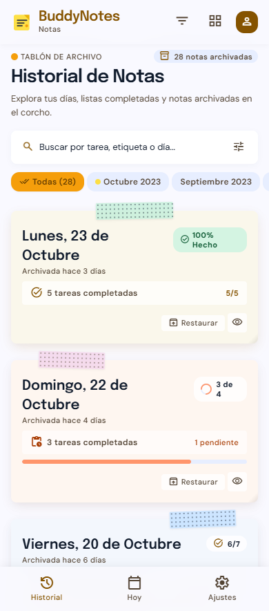
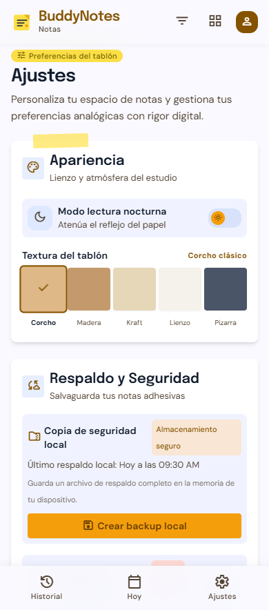
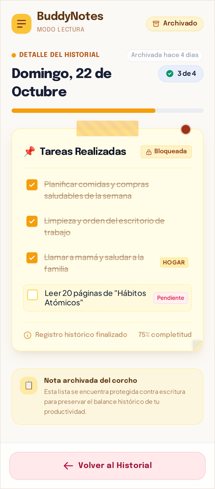

# Plantilla: propuesta del Proyecto A

---

## 0 · Datos

| |                      |
|---|----------------------|
| **Nombre de la app** | BuddyNotes           |
| **Autor/a** | Diego González López |
| **Fecha** | 01/10/2026           |

---

## 1 · La idea en una frase

> Qué hace tu app y para quién, en una sola frase.
>
> Fórmula: «Una app que permite a [quién] hacer [qué] para [para qué].»

>Una app que permite a la gente que siempre tiene el mobil encima apuntar tareas o eventos importantes del día para poder llevar control y un historial a futuro
---

## 2 · El problema

> ¿Qué problema resuelve? ¿Cómo se resuelve hoy sin tu app?

> Como problema resuelve el tener un sitio comodo donde poder llevar un registro de tus actividades diarias.
> A día de hoy esto se puede resolver con una libre haciendolo a mano o incluso con las notas del teléfono. El objetivo clave es hacerlo cómodo e intuitivo para el usuario de forma que sea lo primero que le venga a la mente
---

## 3 · Personas usuarias

> ¿Quién la va a usar? Describe a una persona concreta: edad, soltura con la
> tecnología, cuándo y dónde abre la app, cuánto tiempo le dedica y qué pasa
> si le falla.

>La persona objetivo son gente de entre 15 y 30 años, totalmente acostumbrados a la tecnología y que no tengan demasiado apego a las
> herramientas convencionales de forma que busquen la practicidad y la comodidad (el perfil es alguien despistado que busque evitar olvidar cosas). 
>
> El objetivo es que la app sea un pequeño cajón de  pensamientos al cual acudir a lo largo de todo el día
> para consultar, registrar o incluso tachar cosas propuestas al inicio del día.
> 
> En caso de fallo de la app, obviamente el usuario tiene la opcion de volver a metodos tradicionales. Aunque dado
> la naturaleza local de esta no debería haber casos en los cuales el usuario no pudiera añadir registro como 
> si se podrían limitar algunas funciones por ejemplo.

---

## 4 · Funcionalidades

### Imprescindibles (sin esto la app no tiene sentido)

| #   | Funcionalidad                                                                              |
|-----|--------------------------------------------------------------------------------------------|
| F1  | Crear lista con tareas diarias                                                             |
| F2  | Guardar listas diarias de días anteriores para poder consultarlas                          |
| F3  | Poder registrar cada día con una serie de fotos asociadas y un resumen de este             |
| F4  | Exportar los datos a un fichero que poder utilizar de backups o para migrar de dispositivo |                                                                           |

### Opcionales (si sobra tiempo)

| #  | Funcionalidad                                                                              |
|----|--------------------------------------------------------------------------------------------|
| O1 | Poder ligar tareas a ubicaciones en concretro y agruparlas en un historico                 |
| 02 | Agrupar tareas en categorias o hacerlas recurrentes en base a preferencias                 |

---

## 5 · Pantallas

| Pantalla              | Para qué sirve                                                                                                                                                                     | Se llega desde |
|-----------------------|------------------------------------------------------------------------------------------------------------------------------------------------------------------------------------|----------------|
| Inicio - Lista actual | Es la pantalla mas importante y donde se van a ir registrando y operando con las tareas                                                                                            | (arranque)     |
| Historico             | Sirve para poder abrir la lista de otro día y poder ver cual fue el transcurso de este                                                                                             | Inicio         |
| Ajustes               | Pantalla donde gestionar las preferencias del usuario en base a las opciones disponibles y las opciones de recuperación (modo oscuro, color de fondo y asociar colores diferentes) | Inicio         |
| Lista antigua         | Pantalla donde poder ver la lista de otro dia, similar a la actual pero sin posibilidad de editar                                                                                  | Historico      |
---

## 6 · Bocetos

> Dibuja las pantallas principales. A mano y fotografiado es válido.
> Pega aquí las imágenes o indica el nombre de los archivos adjuntos.

> Hice los bocetos por medio de IA utilizando Google Stich (Nos lo enseño el profesor de Desarrollo de Interfaces) y
> me parece una buena forma de ejemplificar los bocetos a algo mas cercano al objetivo final 

### Inicio

### Historico

### Ajustes

### Lista Antigua

---

## 7 · Qué datos guarda la app

| Tipo de dato | Campos                  | Ejemplo                                                                                                                                                                |
|--------------|-------------------------|------------------------------------------------------------------------------------------------------------------------------------------------------------------------|
| Integer      | id_lista                | Valor autoincremental que se le da a cada lista diaria para luego relacionar los registros                                                                             |
| Date         | fecha_lista             | Fecha del dia para poder relacionarla a la fecha real y facilidar el desarrollo y el tratamiento de datos                                                              |
| Integer      | id_registro             | Valor autoincremental que se le da a cada nueva tarea                                                                                                                  |
| String       | registro                | Texto de la tarea asociada al id                                                                                                                                       |
| Datetime     | fecha_creacion_registro | Fecha y hora de la creacion ( que va a ser autogenerada en la creacion)                                                                                                |
| Datetime     | fecha_fin_registro      | Fecha y hora de la finalizacion de la tarea, la guardamos para futuras funciones y por llevar registro, tambien nos indica si se terminó la tarea                      |
| Integer      | id_tipo_categoria       | Id del tipo de tarea (podemos querer que sea boolean o por porcentaje de finalizacion )                                                                                |
| String       | nombre_tipo_categoria   | Texto del nombre de la tarea para que sea legible por el desarrollador                                                                                                 |
| Integer      | porcentaje_finalizacion | Valor donde guardaremos el estado de la tarea                                                                                                                          |
| Integer      | id_imagen               | Valor autoincremental que se le da a cada imagen para luego relacionarla la lista correspondiente                                                                      |
| String       | imagen                  | Esto puede ser o bien la ruta de la imagen ( mas liviano) o bien la imagen pasada a Base64 (la hace independiente pero tambien supone un consumo en el almacenamiento) |

---

## 8 · Encaje con los requisitos del módulo

> Apartado obligatorio: ninguna casilla puede quedar vacía.

| Requisito                                                             | Dónde encaja en tu app                                                                                                                                                                                                                                 | Tema |
|-----------------------------------------------------------------------|--------------------------------------------------------------------------------------------------------------------------------------------------------------------------------------------------------------------------------------------------------|------|
| **Persistencia de datos** — la información sobrevive al cerrar la app | En la parte del histórico y para mantener la lista actual a lo largo del días                                                                                                                                                                          | 4    |
| **Servicio web** — la app consulta datos por internet                 | Se pueden consultar miscelaneas como la temperatura o el pronostico en las proximas horas para ayudar al usuario                                                                                                                                       | 5    |
| **Sensor o localización**                                             | Se pueden utilizar el acelerómetro y el giroscopio para hacer atajos y la huella de actilar para proporcionar mas seguridad                                                                                                                            | 6    |
| **Contenido multimedia** — foto, audio, vídeo o animación             | El objetivo es que se pueda incluir un pequeño carrusel de imagenes para memorar cada días además de animaciones en diversos puntos para mantener al usuario motivado (Por ejemplo por utilizar la app x días seguidos o al completar la lista diaria) | 7    |

---

## 9 · Riesgos

| Lo que me preocupa          | Plan B                                                                                                           |
|-----------------------------|------------------------------------------------------------------------------------------------------------------|
| Problemas de almacenamiento | Utilizar estructuras de datos mas eficientes y alternativas como utilizar la ruta de la imagen en vez de Base 64 |
| Desinteres del usuario      | Utilizar recordatorios por notificaciones y objetivos para motivarlo                                             |

---

## Antes de entregar

- [x] La idea cabe en una frase.
- [x] El público es una persona concreta, no «todo el mundo».
- [x] Hay **3 o 4** funcionalidades imprescindibles, no diez.
- [x] Cada funcionalidad imprescindible tiene su pantalla.
- [x] Hay bocetos de las pantallas principales.
- [x] **Las cuatro casillas del apartado 8 están rellenas.**
- [x] Está identificado al menos un riesgo con su plan B.
